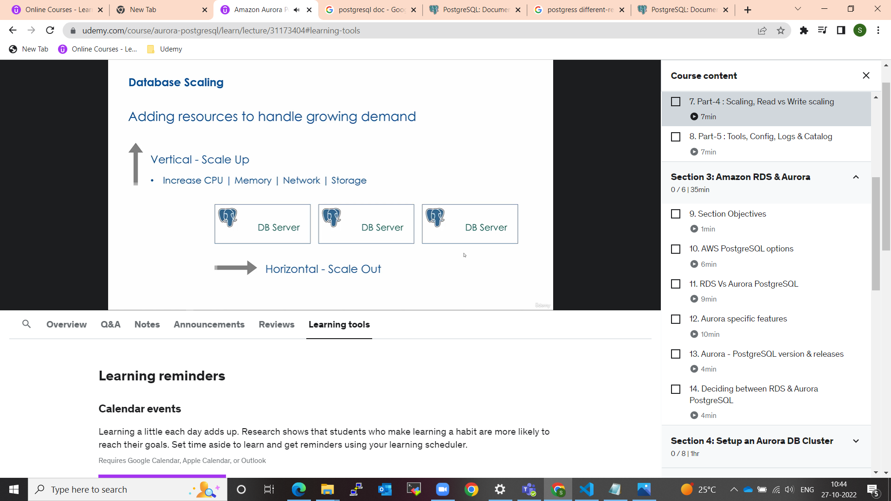

## Scaling the postGressSQL DataBase
Topics
- Vertical vs Horizontal Scaling 
- Scaling for READS (insert, update Delete)
- Scaling for WRITES

[Reference](https://www.udemy.com/course/aurora-postgresql/learn/lecture/31173404#learning-tools)