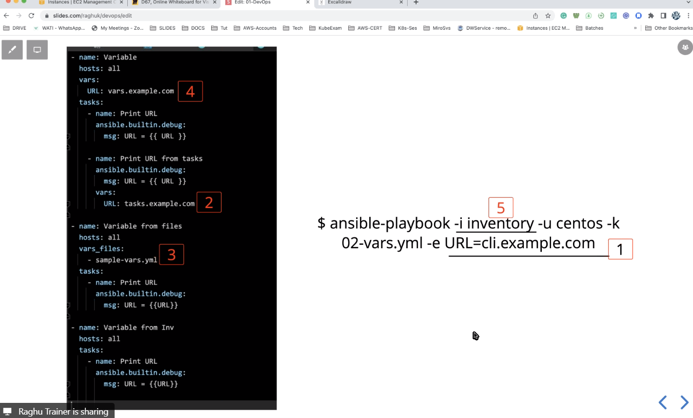
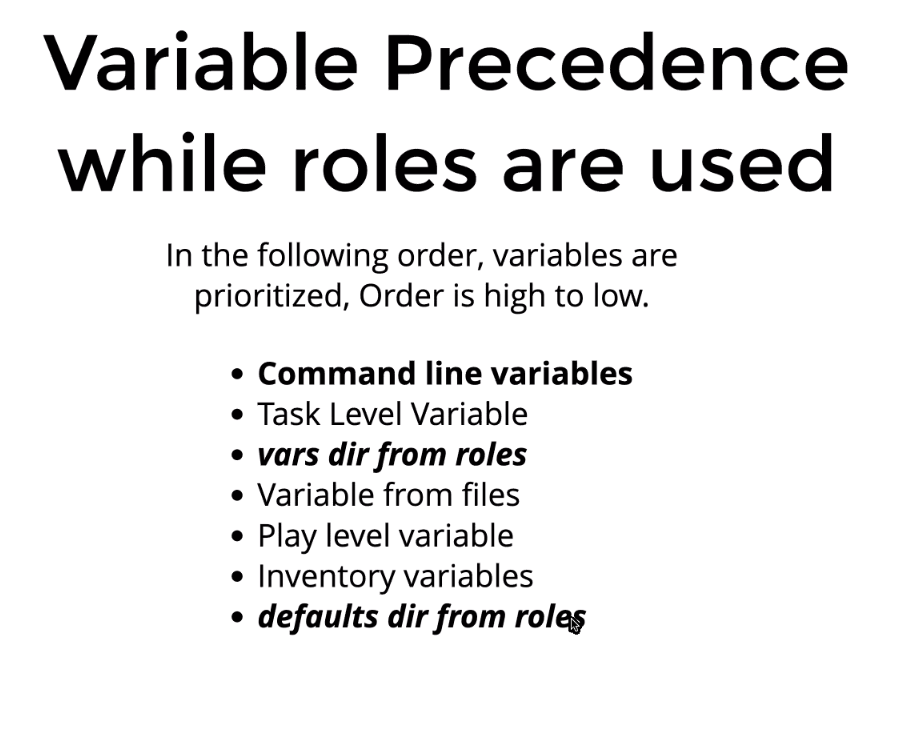
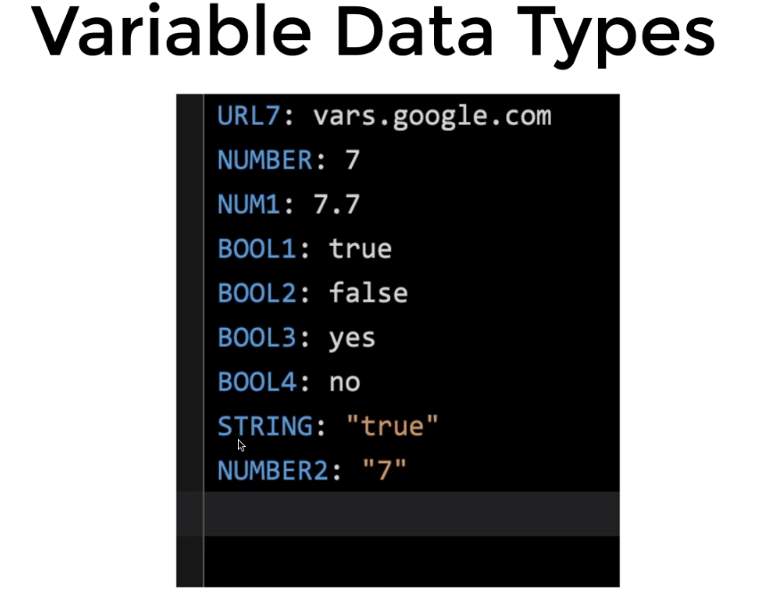

## varible precedence
- comand line varible
- Task Level Varible
- Varible From Files
- play level Varible
- inventory varibles



## Ansible Pre-Define Varibles(Facts)
- example: ansible_hostname

## Ansible Run Time VArible
- register varibles (from the out put)
- Set_facts ()
## Ansible connection Varibles
## Ansible Roles (group of tasks)
# varible precedence while roles used 


## Varible Data Types 


## Ansible Pull 

- ansible-pull --help
- ansible-pull -i localhost, -U Https://GIt-Repo -e ROLE_NAME=frontend

## Ansible Loops
```f
- name: Demo on Loops
  hosts: localhost
  tasks:
    - name: Print Debug with List of Values Loop
      ansible.builtin.debug:
        msg: Fruit Name = {{item}}
      loop:
        - apple
        - banana
        - orange
    - name: Print Debug with List of Maps
      ansible.builtin.debug:
        msg: Fruit Name = {{item.name}}, Quantity = {{item.quantity}}
      loop:
        - { name: "apple", quantity: 100 }
        - { name: "banana", quantity: 200 }
        - { name: "orange", quantity: 50 }
```